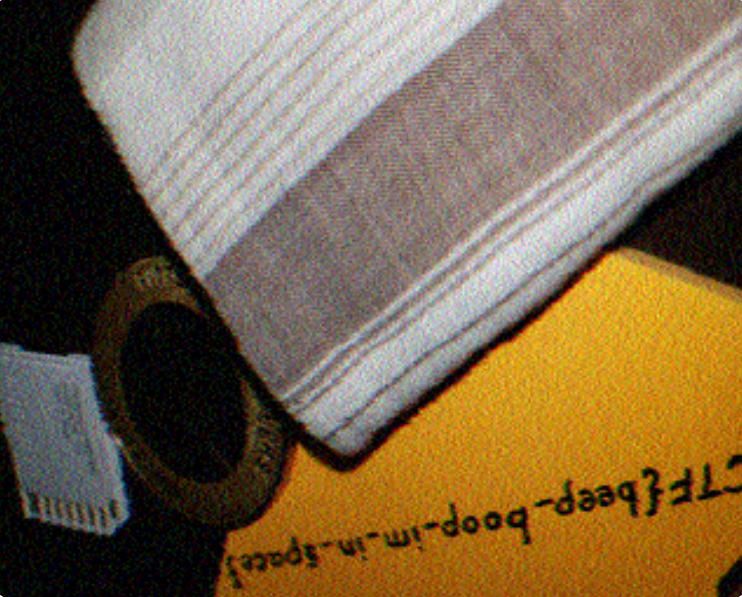

# 1. m00nwalk

Decode this message from the moon.

## Solution:

I understood here that we had to decode a file. I then used the hint of how moon images were sent back to earth. Radio waves are converted into images via SSTV. I used an online sstv decoder to get an image.


## Flag:

```
picoCTF{beep_boop_im_in_space}
```

## Concepts learnt:

- I have learnt how to use an SSTV decoder and how images from the moon were sent back to earth.

## Notes:

- Include any alternate tangents you went on while solving the challenge, including mistakes & other solutions you found.
- 

## Resources:

- play.picoctf.org

# 2. 
