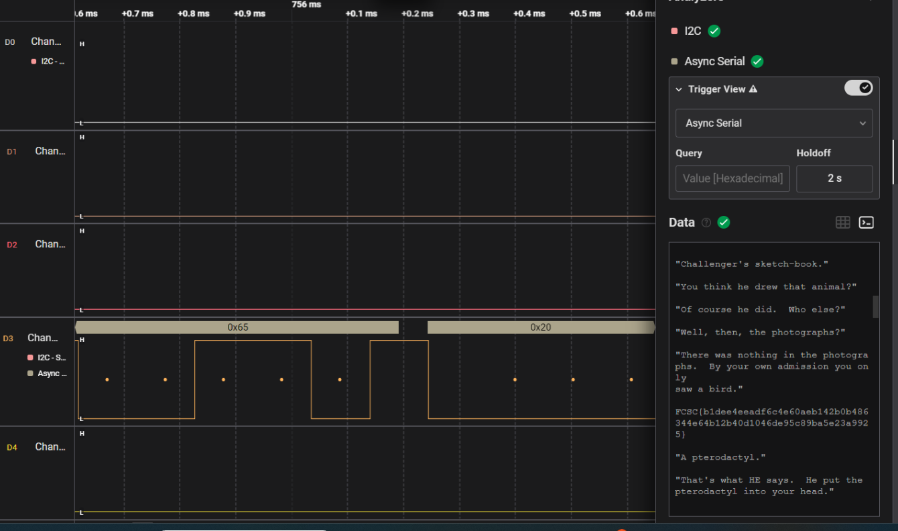

# 1. IQ Test

let your input x = 30478191278.

wrap your answer with nite{ } for the flag.

As an example, entering x = 34359738368 gives (y0, ..., y11), so the flag would be nite{010000000011}.

## Solution:

To solve this challenge, I first had to convert 30478191278 into binary to solve the logic gates. I got 35 digits, 11100011001100110010000101101101110. I then input these values and got 11 y values, 10001111000.

## Flag:

```
nite{10001111000}
```

## Concepts learnt:

- I have learnt the concept of logic gates.

## Resources:

- play.picoctf.org


# 2. I like Logic:

i like logic and i like files, apparently, they have something in common, what should my next step be. 

They also gave a .sal file.

## Solution:

- They gave a .sal file, so I searched up what sal files are and how we can open them. I learnt that to view it, we need a sal analyser like Saleae Logic 2 software. So first I installed the software and set it up.
- After opening the file in the software, by clicking open a capture, I zoomed in on the D3 challenge file, and it had a pulsating square wave kind of signal. The rest of them had a straight line. Then we had to set up the analyser to Async serial, from I2C which was the default one. I thought of this as something similar was taught in my electronics class. After we set up the analyser to Async serial, we will get some hex values on the graph and we will also get a table of data, which we can export.
- I then exported the data table, and it gave it in a csv file format. I looked around in the table but could not find anything.
- I then opened the terminal code in the software, and there was some random story written in it, and in between the story the flag was there.



## Flag:

```
FCSC{b1dee4eeadf6c4e60aeb142b0b486344e64b12b40d1046de95c89ba5e23a9925}
```

## Concepts learnt:

- I learnt about what .sal files are, they store hardware analysis captures.
- I learnt how we can open sal files using the Logic 2 software and how we can analyse those files in that software.

## Notes:

- I first couldn't figure out why I couldn't add new analysers and why it told device disconnected, but later figured out that it should be like that and we have to click open capture to open the file.
- I first couldn't figure out where the flag was, until I figured out it was in the terminal. 

## Resources:

- Logic 2 software
- https://file.org/extension/sal

# 3. Bare metal alchemist: 

My friend recommended me this anime but i think i've heard a wrong name.

They also gave a .elf file. 

## Solution:

- They gave a elf file, so I first searched on google what a elf file and and how we can open it. It told that its an executable format file and we can use a disassembler to get the code.
- I first tried keeping it in IDA, but it didnt open, and it seems we need the pro version.
- So I downloaded Ghidra to diassemble the file. After I disassembled the file, there was a code, and it was similar to the challenges in reverse engineering.
-  The hint they gave was something related to anime. So I searched it up and found that alchemy is basically transformation of one thing and reconstructing it into another. That was a similar thing the code was doing, here i used a formula which was XOR with 0xA5 to transform the bytes back into their original. The code used high resister and address usage, so I had to take some time to understand it. 
-  so basically one register was given a number 0xa5 which is 165 and loop was given an address and an operation was performed on every byte and loops stops when the encrypted byte equals to the key and then a null character was present so the plain text was xored with key and exits on 0 byte so we xored the encrypted byte with key to decrypt all bytes one by one and then we obtain the flag.
-  After all this is done, we have to xore each number using some online xore website, and then we will get the flag.


## Flag:

```
TFCCTF{Th1s_1s_s0m3_s1mpl3_4rduno_f1rmw4re}
```

## Concepts learnt:

- I learnt that we can use ghidra for free to disassemble codes.
- I learnt that C codes can also be written in form of registers and addresses which is pretty complex. 


## Resources:

- https://www.geeksforgeeks.org/linux-unix/readelf-command-in-linux-with-examples/
- https://onlinetools.com/hex/xor-hex-numbers
- https://xor.pw/
