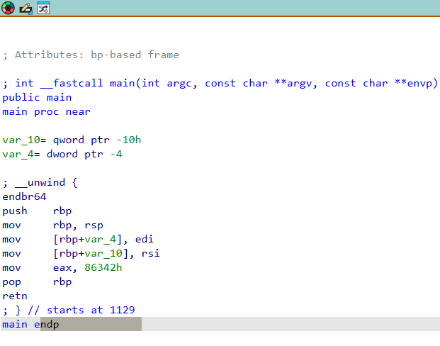

# 1. GDB Baby step 1

Can you figure out what is in the eax register at the end of the main function? Put your answer in the picoCTF flag format: picoCTF{n} where n is the contents of the eax register in the decimal number base. If the answer was 0x11 your flag would be picoCTF{17}.
Disassemble this.

## Solution:

I understood here that we had to disassemble a file. I then installed IDA which is a file disassembler, and disassembled the file to get the following output. I then used the second clue and obtained a hexadecimal input 86342 and converted it to decimal which is 549698.


## Flag:

```
picoCTF{549698}
```

## Concepts learnt:

- I have learnt how to use a disassembler and the conversion of a hexadecimal to decimal.

## Notes:

- Include any alternate tangents you went on while solving the challenge, including mistakes & other solutions you found.
- 

## Resources:

- play.picoctf.org

***

# 2. ARMssembly 1

For what argument does this program print `win` with variables 81, 0 and 3? File: chall_1.S Flag format: picoCTF{XXXXXXXX} -> (hex, lowercase, no 0x, and 32 bits. ex. 5614267 would be picoCTF{0055aabb})

## Solution

I understood here we would have to reverse engineer and get familiar with a few functions. I learnt the mov, lsl, sdiv, ldr, etc to figure out the path to find the flag. First 81, 3, and 0 were respectively assigned to a variable using mov. 81 was then shifted left twice using lsl. Then 81 was divided by 3 to get 27. To 'win' we need zero, so 27 - input = 0. Input = 27. On converting 27 to 32 bit hexa to get 0000001b.
![image](

```
.arch armv8-a
	.file	"chall_1.c"
	.text
	.align	2
	.global	func
	.type	func, %function
func:
	sub	sp, sp, #32
	str	w0, [sp, 12]
	mov	w0, 81
	str	w0, [sp, 16]
	str	wzr, [sp, 20]
	mov	w0, 3
	str	w0, [sp, 24]
	ldr	w0, [sp, 20]
	ldr	w1, [sp, 16]
	lsl	w0, w1, w0
	str	w0, [sp, 28]
	ldr	w1, [sp, 28]
	ldr	w0, [sp, 24]
	sdiv	w0, w1, w0
	str	w0, [sp, 28]
	ldr	w1, [sp, 28]
	ldr	w0, [sp, 12]
	sub	w0, w1, w0
	str	w0, [sp, 28]
	ldr	w0, [sp, 28]
	add	sp, sp, 32
	ret
	.size	func, .-func
	.section	.rodata
	.align	3
.LC0:
	.string	"You win!"
	.align	3
.LC1:
	.string	"You Lose :("
	.text
	.align	2
	.global	main
	.type	main, %function
main:
	stp	x29, x30, [sp, -48]!
	add	x29, sp, 0
	str	w0, [x29, 28]
	str	x1, [x29, 16]
	ldr	x0, [x29, 16]
	add	x0, x0, 8
	ldr	x0, [x0]
	bl	atoi
	str	w0, [x29, 44]
	ldr	w0, [x29, 44]
	bl	func
	cmp	w0, 0
	bne	.L4
	adrp	x0, .LC0
	add	x0, x0, :lo12:.LC0
	bl	puts
	b	.L6
.L4:
	adrp	x0, .LC1
	add	x0, x0, :lo12:.LC1
	bl	puts
.L6:
	nop
	ldp	x29, x30, [sp], 48
	ret
	.size	main, .-main
	.ident	"GCC: (Ubuntu/Linaro 7.5.0-3ubuntu1~18.04) 7.5.0"
	.section	.note.GNU-stack,"",@progbits
```

## Flag:

```
picoCTF{0000001b}
```

## Concepts learnt

- I have learnt new functions including mov used to assign values to variables, lsl to shift, sdiv to divide, ldr, etc. I have learnt how to reverse engineer and convert decimal to hexa decimal.


## Notes:

## Resources

- https://cseweb.ucsd.edu/classes/fa15/cse30/lectures/lec8_detailed.pdf
- play.picoctf.org

# 3. vault-door-3

This vault uses for-loops and byte arrays. The source code for this vault is here: VaultDoor3.java

## Solution

In this challenge, we know the final output values (aka buffer) and make a table for the buffer, the password index and the corresponding values. I then used the table to form the password and retrieve the flag.

```
pw    buffer   char
0	       0	    j
1	       1	    U
2	       2	    5
3	       3	    t
4	       4	    _
5	       5	    a
6	       6	    _
7	       7	    s
8	      15	    1
9	      14	    m
10	    13	    p
11	    12	    l
12	    11	    3
13	    10	    _
14	     9	    a
15	     8	    n
16	    30	    4
17	    17	    g
18	    28	    r
19	    19	    4
20	    26	    m
21	    21	    _
22	    24	    4
23	    23	    u
24	    22	    _
25	    25	    c
26	    20	    7
27	    27	    9
28	    18	    a
29	    29	    2
30	    16	    1
31	    31	    
```

## Flag:

```
picoCTF{picoCTF{jU5t_a_s1mpl3_an4gr4m_4_u_c79a21}
```

## Concepts learnt
I have learnt how to reverse engineer, form a table from the output and reach the input to retrieve the flag.

## Notes:

## Resources:
- play.picoctf.org

  


