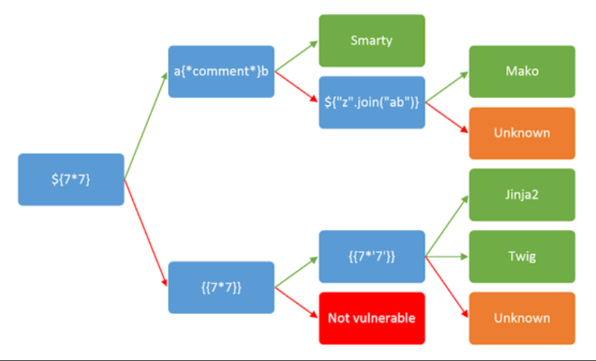

# 1. Web Gauntlet

Can you beat the filters?
Additional details will be available after launching your challenge instance.

## Solution:

Here we have to use the filters and a few commands to solve this challenge. I first entered admin and a random password. It then shows the AND operator, so we have to get rid of that. So I figured we could use the ; to terminate the command right after admin' which wouldn't require the correct password for login. I could do this till round 3 but from round 4, admin got filtered out. It took me a while but I remembered linux we used in JTP1. I tried to pipe adm and in. I first got stuck where I used only a single '|'. However, when I searched online it showed that we would have to use 2 |. Once I figured this out, it worked and I retrieved the flag


## Flag:

```
picoCTF{y0u_m4d3_1t_79a0ddc6}
```

## Concepts learnt:

- I learnt SQL injection, and how to get around passwords for the correct login.

## Notes:

- Include any alternate tangents you went on while solving the challenge, including mistakes & other solutions you found.

## Resources:

- play.picoctf.org

# 2. SSTI1

I made a cool website where you can announce whatever you want! Try it out!
Additional details will be available after launching your challenge instance.

## Solution:

Here it is mentioned that the given website displays what we want it to. I used the help of a flowchart to check the template injection vulnerability. I first input {7*7} which did not work, so based on the flowchart, I then input {{7*7}} which worked and showed 49. I then input {{7*'7'}} which gave 7777777. I then used the website listed below and played around. I input {{request.application.__globals__.__builtins__.__import__('os').popen('id').read()}} in the website. When executed, I observed that it is executing the id part. So instead I used linux and told it to cat flag when then displayed the flag.


## Flag:

```
picoCTF{s4rv3r_s1d3_t3mp14t3_1nj3ct10n5_4r3_c001_f5438664}
```
## Concepts learnt:

- I learnt how to find the vulnerability of a template injection. I then learnt exploring websites to figure out the right executable link.

## Notes:

- I did not know what exactly to do after finding the vulnerability. I had to discuss with my friends and explore the web to find a website and discover the process.

## Resources:

- play.picoctf.org
- https://www.cobalt.io/blog/a-pentesters-guide-to-server-side-template-injection-ssti


- https://onsecurity.io/article/server-side-template-injection-with-jinja2/


# 3. Cookies

Who doesn't love cookies? Try to figure out the best one. http://mercury.picoctf.net:27177/

## Solution:

Here we have to inspect the given website and change the values of the cookies till /check gives the correct output. It took a while, when I reached the value of 18, the flag was displayed.


## Flag:

```
picoCTF{3v3ry1_l0v3s_c00k135_064663be}
```

## Concepts learnt:

- I learnt how to change the settings of a website, and to work around usual website settings.

## Notes:

- I started all the way from 0 to 17 before I got the flag in 18.

## Resources:

- play.picoctf.org


